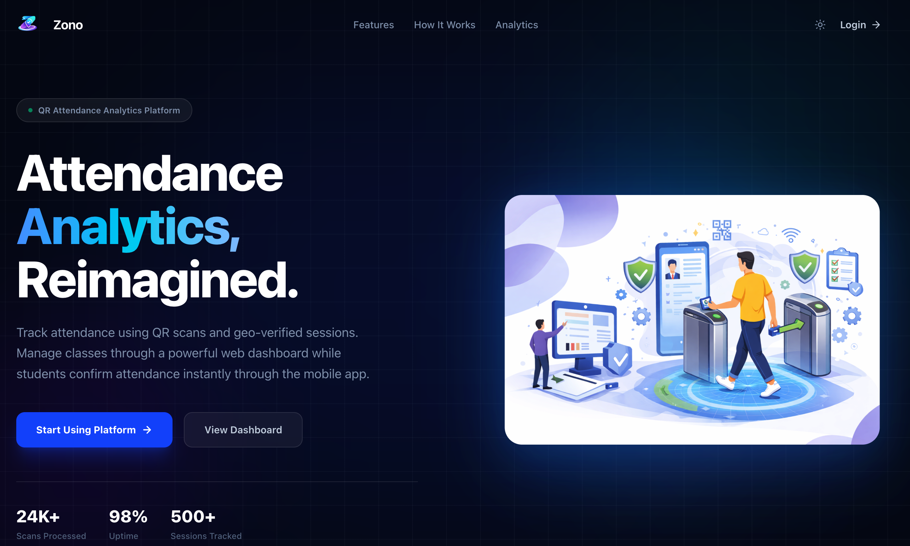
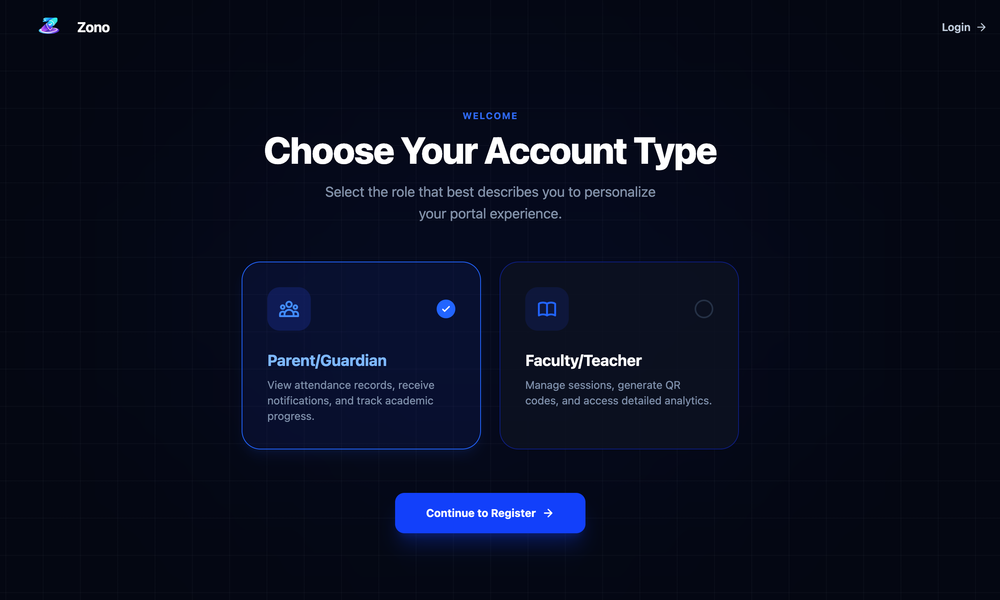
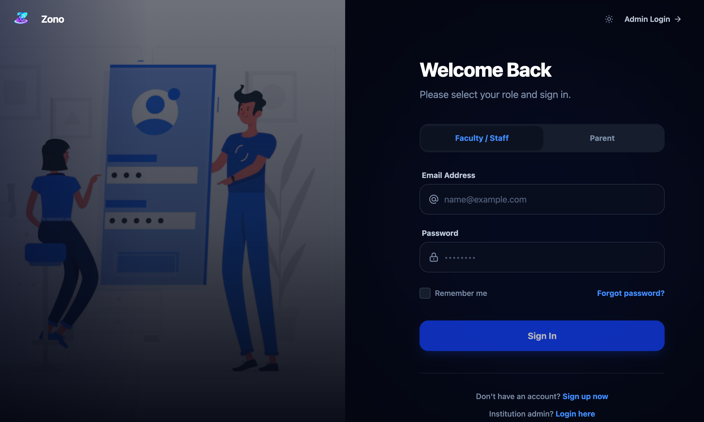
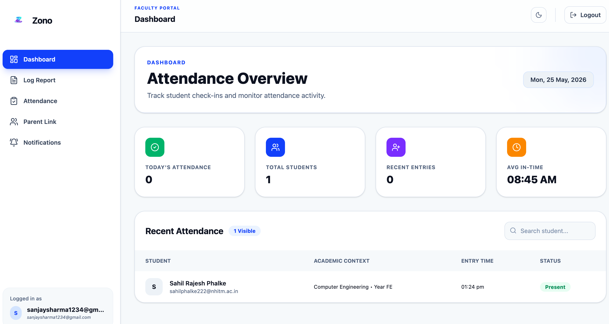
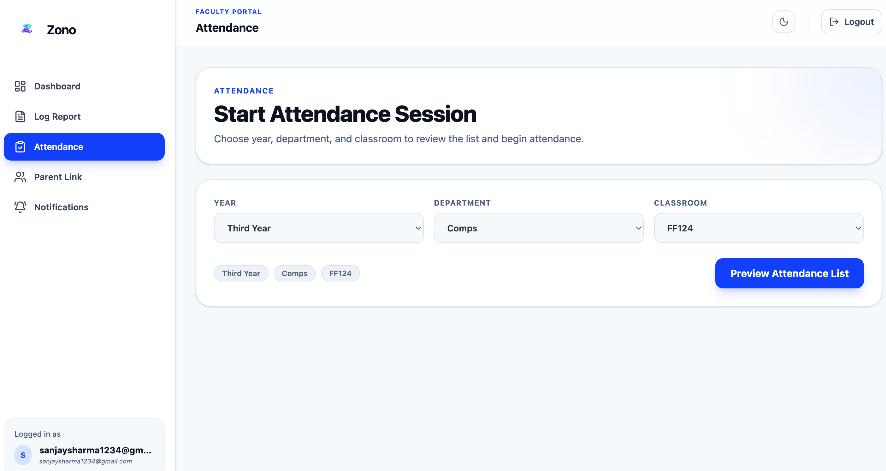
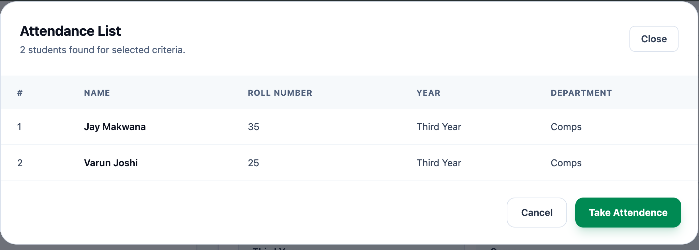
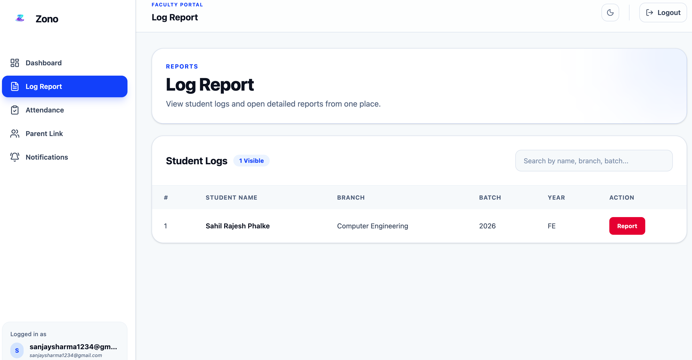

<div align="center">


### ZONO - Smart Attendance & Institution Management System

**A full-stack platform where teachers start GPS-verified attendance sessions, students mark presence from their phones, parents track their child's attendance via OTP login, and institution admins manage everything — one dashboard.**

<br/>


<br/>

[🌐 Deployment : https://zono-system.vercel.app](https://zono-system.vercel.app)

</div>

---

## 📖 Overview

ZONO is a **multi-role institution management and GPS attendance system** built for schools and colleges. Each institution gets its own workspace — its own teachers, students, classrooms, and parent connections — all managed through a clean web interface.

The core idea is simple:

- Students are enrolled with QR scan data or manual entry.
- Teachers define physical classrooms using GPS coordinates.
- A teacher starts a **live attendance session** — it auto-expires in 2 minutes.
- Students open the attendance page on their phone; if they are physically inside the classroom boundary, they can mark themselves present.
- Proxy attendance is **prevented** — you must be in the room with an active session.
- Parents log in using their phone number + OTP and view their child's attendance calendar.
- Admins manage teachers, parent links, and analytics.
- A **super-admin (ZonoAdmin)** approves new institution applications at the platform level.

---

## 🌐 Live Demo

| Service | URL |
|---|---|
| **Deployment** | [https://zono-system.vercel.app](https://zono-system.vercel.app) |

---

## 🖼️ Screenshots

### 1. Landing Page


### 2. Roles Selection


### 3. Teacher / Staff Login


### 4. Teacher Home Dashboard


### 5. GPS Attendance Session



<!-- ### 6. Student Attendance Marking (Mobile)
<p align="center">
  
</p> -->

### 7. Log Report Page

<!-- 
### 8. Student Report Writing
 -->

<!-- ### 9. Admin Dashboard


### 10. Admin — Teacher Management


### 11. Admin — Parent Linking


### 12. Admin — Analytics


### 13. Parent OTP Login (Mobile)
<p align="center">
  
</p>

### 14. Parent Attendance Calendar


### 15. ZonoAdmin Dashboard
 -->

---

## ✨ Core Features

### 👨‍🎓 For Students
- Mark attendance using GPS — physically inside the classroom only.
- Login with IEN (enrollment number) and password.
- Real-time polling to check if an attendance session is currently active.
- Duplicate attendance marking is blocked automatically.

### 👨‍🏫 For Teachers / Staff
- Start a live GPS attendance session for a class (auto-expires in 2 minutes).
- View all students and their QR scan records.
- Write behavioral/academic reports for individual students.
- Receive real-time notifications when parent links are updated (Socket.IO).
- Manage parent-student contact linking.
- Accept or reject institution invitations.

### 🏛️ For Institution Admins
- Register institution and await ZonoAdmin approval.
- Create teacher accounts or invite existing staff.
- Link students to parent phone numbers / emails.
- View institution-wide attendance analytics.
- Manage institution profile and password.

### 👨‍👩‍👦 For Parents
- Login via phone number + OTP (SMS-based, no password required).
- View child's full attendance calendar by month.
- Account is auto-created when an admin links their contact to a student.

### 🔑 For ZonoAdmin (Platform Super Admin)
- Review and approve institution registration applications.
- View all institutions (pending and active) across the platform.
- Generate and distribute admin credentials upon approval.
- Brute-force protected login with account lockout after 5 attempts.

---

## 🏗️ Architecture

```text
User Browser
   │
   ▼
Frontend (React + Vite) — Vercel
   │
   ├── Public pages        (landing, login, register, roles)
   ├── Teacher modules     (home, attendance, reports, notifications, parents)
   ├── Admin modules       (dashboard, teachers, parent linking, analytics, profile)
   ├── Parent module       (OTP login, attendance calendar)
   └── ZonoAdmin module    (institution management, approval)
   │
   ▼
Backend (Node.js + Express) — Vercel
   │
   ├── Session-based Authentication   (express-session + MongoStore)
   ├── Role-based Middleware           (staff / admin / parent / zono_admin)
   ├── QR Student Data API
   ├── GPS Attendance System
   ├── Classroom GPS Management
   ├── Parent OTP System              (SMS via Textbelt)
   ├── Admin & Institution Management
   ├── Teacher Invitation System
   ├── Socket.IO Real-time Events
   └── ZonoAdmin Approval System
   │
   ▼
MongoDB Atlas
   │
   ├── admins                
   ├── institutions
   ├── staff                     
   ├── students
   ├── attendstudents            
   ├── attendance
   ├── activeattendancesessions  ← TTL: auto-expires in 2 min
   ├── classrooms                
   ├── parents
   ├── parentotps                ← TTL: auto-expires in 15 min
   ├── invitations               
   ├── reports
   ├── sessionlogs               
   └── zono_admins
```

### Architecture Diagram


### Why this architecture?
- **Frontend** handles only UI, routing, and API calls — thin and fast.
- **Backend** owns all business rules, auth, permissions, and database writes.
- **Session-based auth** (not JWT) with MongoDB storage keeps sessions revokable and secure.
- **TTL indexes** on MongoDB auto-expire attendance sessions and OTPs — no cron jobs needed.
- **Socket.IO** pushes live updates to teachers without polling.

---

## 🛠️ Tech Stack

### Frontend
| Package | Purpose |
|---|---|
| React 19 | UI framework |
| Vite | Build tool and dev server |
| React Router DOM | Client-side routing |
| Tailwind CSS v4 | Utility-first styling |
| DaisyUI | Component library (bumblebee theme) |
| Axios | HTTP client |
| Socket.IO Client | Real-time WebSocket communication |
| Lucide React | Icon library |

### Backend
| Package | Purpose |
|---|---|
| Node.js + Express | HTTP server and API framework |
| MongoDB + Mongoose | Database and ODM |
| express-session + connect-mongo | Server-side session storage |
| bcryptjs | Password hashing |
| Socket.IO | Real-time bi-directional events |
| Joi | Request body validation |
| nodemailer | Email delivery (OTP fallback) |
| dotenv | Environment variable management |
| cors | Cross-origin request handling |

### Delivery
| Service | Purpose |
|---|---|
| Textbelt API | SMS OTP delivery |
| SMTP (nodemailer) | Email OTP fallback |
| MongoDB Atlas | Cloud database |
| Vercel | Frontend + backend deployment |

---

## 📁 Project Structure

```text
ZONO/
├── package.json                       ← Root workspace config
│
├── backend/
│   ├── app.js                         ← Entry point — server, sessions, Socket.IO, routes
│   ├── package.json
│   ├── vercel.json                    ← Vercel deployment config
│   │
│   ├── controllers/
│   │   ├── adminController.js         ← Institution admin business logic
│   │   ├── adminRegistrationController.js
│   │   ├── attendStudentController.js ← Student login, GPS session polling
│   │   ├── classroomController.js     ← GPS classroom CRUD
│   │   ├── facultyController.js       ← Start attendance session (TTL)
│   │   ├── markAttendanceController.js← GPS-verified attendance marking
│   │   ├── parentAuthController.js    ← OTP request, verify, calendar
│   │   ├── reportController.js        ← Student report writing
│   │   ├── staffController.js         ← Legacy staff register
│   │   ├── studentController.js       ← QR scan data save/update
│   │   └── zonoAdminController.js     ← Platform super admin logic
│   │
│   ├── model/
│   │   ├── activeAttendence.js        ← Live session (TTL: 2 min auto-delete)
│   │   ├── admin.js                   ← Institution admin account
│   │   ├── attendStudent.js           ← Attendance-eligible student
│   │   ├── attendance.js              ← Attendance record
│   │   ├── classroom.js               ← GPS-bounded classroom definition
│   │   ├── institution.js             ← School / college
│   │   ├── invitation.js              ← Teacher invitation
│   │   ├── parent.js                  ← Parent account
│   │   ├── parentOtp.js               ← OTP storage (TTL: 15 min auto-delete)
│   │   ├── report.js                  ← Student report
│   │   ├── sessionLog.js              ← Login/logout audit trail
│   │   ├── staff.js                   ← Teacher account
│   │   ├── student.js                 ← QR scan student record
│   │   └── zonoAdmin.js               ← Platform super admin
│   │
│   ├── middleware/
│   │   ├── authMiddleware.js          ← requireUserAuth, requireRoles, requireZonoAdminAuth
│   │   └── validationMiddleware.js    ← Joi request validation
│   │
│   ├── routes/
│   │   ├── router.js                  ← /api/* all main routes
│   │   ├── adminRegistrationRoutes.js ← /api/admin/register
│   │   └── zonoAdminRoutes.js         ← /api/zono-secure-admin/*
│   │
│   ├── services/
│   │   └── admin.service.js           ← Admin registration business logic
│   │
│   ├── utils/
│   │   ├── authUtils.js               ← bcrypt hash + verify helpers
│   │   ├── otpUtils.js                ← OTP generate, SMS, email delivery
│   │   └── socket.js                  ← Socket.IO singleton + room helpers
│   │
│   └── scripts/
│       └── seedZonoAdmin.js           ← One-time super admin account seed
│
└── frontend/
    ├── package.json
    └── src/
        ├── App.jsx                    ← All route definitions
        ├── main.jsx                   ← React app bootstrap
        ├── index.css                  ← Global styles
        │
        ├── constants/
        │   ├── api.js                 ← API_BASE and SOCKET_URL
        │   └── zonoAdminPaths.js      ← Obscure ZonoAdmin route paths
        │
        ├── utils/
        │   └── sessionClient.js       ← Session cache (memory + sessionStorage)
        │
        └── components/
            ├── ProtectedRoute.jsx     ← Route guard (role + institution check)
            ├── Header.jsx
            ├── Navbar.jsx
            ├── Footer.jsx
            ├── landingPage.jsx        ← Public landing page
            ├── homePage.jsx           ← Teacher home
            ├── loginPage.jsx          ← Staff login
            ├── registerPage.jsx       ← Staff register
            ├── roles.jsx              ← Role selection info page
            ├── adminLoginPage.jsx     ← Admin login
            ├── adminRegisterPage.jsx  ← Institution registration
            ├── adminDashboard.jsx     ← Admin control panel
            ├── attendence.jsx         ← Attendance management
            ├── logReportPage.jsx      ← Student list for reports
            ├── report.jsx             ← Write student report
            ├── parentTestPage.jsx     ← Parent attendance calendar
            ├── teacherNotificationsPage.jsx
            ├── teacherParentsPage.jsx
            ├── zonoAdminLoginPage.jsx ← Super admin login
            └── zonoAdminDashboard.jsx ← Super admin panel
```

---

## 🚀 Getting Started

### Prerequisites

- Node.js 18+
- MongoDB Atlas account (or local MongoDB)
- Git
- A [Textbelt](https://textbelt.com) API key (for SMS OTP)

### Clone the Repository

```bash
git clone https://github.com/lisencetoKILL/ZONO.git
cd ZONO
```

### Install Backend Dependencies

```bash
cd backend
npm install
```

### Install Frontend Dependencies

```bash
cd ../frontend
npm install
```

---

## ⚙️ Environment Variables

### Backend — `backend/.env`

```env
Database
MONGO_URI=your_mongodb_connection_string

Session
SESSION_SECRET=your_strong_random_secret_key
PORT=3001
NODE_ENV=development

CORS — comma-separated allowed origins
FRONTEND_ORIGINS=http://localhost:5173,https://your-frontend.vercel.app

SMS OTP (https://textbelt.com)
TEXTBELT_API_KEY=your_textbelt_api_key

Email OTP — optional SMTP fallback
SMTP_HOST=smtp.gmail.com
SMTP_PORT=587
SMTP_USER=your_email@gmail.com
SMTP_PASS=your_app_password
SMTP_FROM=your_email@gmail.com

ZonoAdmin API path — change to obscure it further (optional)
ZONO_ADMIN_API_PATH=/api/zono-secure-admin
```

### Frontend — `frontend/.env`

```env
VITE_API_BASE=http://localhost:3001
VITE_SOCKET_URL=http://localhost:3001
VITE_ZONO_ADMIN_API_PATH=/api/zono-secure-admin
```

---

## ▶️ Running the Project

Open **two terminals**.

### Terminal 1 — Start Backend

```bash
cd backend
npm run dev
```

Backend starts at → `http://localhost:3001`

### Terminal 2 — Start Frontend

```bash
cd frontend
npm run dev
```

Frontend starts at → `http://localhost:5173`

### First-Time Setup — Seed ZonoAdmin

Run this **once only** to create the platform super admin account:

```bash
cd backend
node scripts/seedZonoAdmin.js
```

> ⚠️ Change the default credentials in the seed script before running in production.

---

## 👥 User Roles

| Role | Login URL | Responsibility |
|------|-----------|----------------|
| **ZonoAdmin** | `/zono-admin-auth-portal` | Approves institution applications, manages the platform |
| **Institution Admin** | `/adminLogin` | Manages teachers, parent links, analytics |
| **Teacher / Staff** | `/login` | Starts attendance, writes reports, manages parent links |
| **Parent** | `/login` (OTP) | Views child's monthly attendance calendar |
| **Student** | Via `/api/loginStudent` | Marks GPS-verified attendance from mobile |

---

## 🧭 GPS Attendance — How It Works

```text
Step 1 ─ Admin defines a classroom as a GPS rectangle
          (lat1, lon1) → (lat2, lon2) stored in MongoDB

Step 2 ─ Teacher clicks "Start Session"
          → ActiveAttendanceSession saved to MongoDB
          → MongoDB TTL index deletes it after 120 seconds automatically

Step 3 ─ Student opens attendance page on phone
          → Browser requests GPS permission
          → App sends GPS coordinates to server
          → Server checks: is GPS inside any classroom boundary?
          → Server checks: is there an active session for this dept/year/classroom?
          → Both YES → returns class roll list

Step 4 ─ Student selects roll number → submits
          → Server re-verifies GPS + active session + duplicate check
          → Attendance record saved to MongoDB

Step 5 ─ After 2 minutes → session auto-deleted
          → No more marking possible for that window
```

**Why proxy attendance is prevented:**
- Student must be **physically inside** the GPS-defined classroom.
- Teacher must have started a session in the **last 2 minutes**.
- Each student can only mark **once per session**.

---

## 🔑 Parent OTP Login — How It Works

```text
Step 1 ─ Parent enters phone number on login page
Step 2 ─ Server generates 6-digit OTP
          → Hashed with bcrypt → saved to MongoDB (expires in 5 min)
          → Sent via SMS using Textbelt API
Step 3 ─ Parent enters OTP
          → Server verifies hash → max 5 attempts enforced
          → Creates server-side session on success
Step 4 ─ Parent lands on /parentTest
          → Sees child's attendance by date (calendar view)
```

Parents are **auto-provisioned** when an admin links their phone to a student — no manual sign-up needed.

---

## 🏛️ Institution Onboarding Flow

```text
Step 1 ─ Institution visits /adminRegister → fills form
          → Institution + Admin created with status: PENDING_APPROVAL

Step 2 ─ ZonoAdmin logs in → reviews the application
          → Clicks "Approve"

Step 3 ─ System auto-generates a strong 14-character password
          → Sets institution + admin to ACTIVE
          → Returns credentials to ZonoAdmin

Step 4 ─ ZonoAdmin shares credentials with the institution
Step 5 ─ Admin logs in → starts managing teachers and students
```

---

## 📡 Real-Time Features (Socket.IO)

Socket.IO enables the server to push events to teacher browsers instantly.

| Event | Trigger | Receiver |
|---|---|---|
| `parent-link-updated` | Admin links parent contact | Teacher's browser |

- Each teacher browser joins a room: `teacher:<email>`.
- Server emits events to the specific teacher's room — no broadcast to unrelated users.
- Teacher notification page shows live updates without page refresh.

---

## 🔒 Security Highlights

- **bcrypt password hashing** — 10 salt rounds, never plain text
- **Server-side sessions** — stored in MongoDB, not browser localStorage
- **httpOnly + secure + sameSite** cookie flags in production
- **Role-based middleware** on every protected route
- **ZonoAdmin brute-force protection** — locks after 5 failed attempts (15 min lockout)
- **Session regeneration** on ZonoAdmin login (prevents session fixation)
- **CORS restricted** to explicit allowed origins only
- **OTP hashed before storing**, expires after 5 minutes
- **Full audit trail** — every login/logout logged to `sessionlogs` collection
- **Invitation system** — teachers must be invited before joining an institution

---

## 🚢 Deployment

### Recommended Setup

| Service | Deploy On |
|---|---|
| Frontend (React + Vite) | Vercel |
| Backend (Node.js + Express) | Vercel (using `vercel.json`) |
| Database | MongoDB Atlas |

### Steps

1. Push your code to GitHub.
2. Import the `backend/` folder as a new Vercel project — it reads `vercel.json` automatically.
3. Import the `frontend/` folder as a separate Vercel project.
4. Set all environment variables in Vercel dashboard for both projects.
5. Set `FRONTEND_ORIGINS` in backend to your Vercel frontend URL.
6. Set `VITE_API_BASE` in frontend to your Vercel backend URL.

---

## 🧭 Future Improvements

- [ ] Email OTP delivery fully configured out of the box
- [ ] Student self-registration portal
- [ ] Attendance report export (PDF / Excel)
- [ ] Push notifications for parents
- [ ] Per-student attendance percentage dashboard
- [ ] Forgot password flow for admins and teachers
- [ ] Mobile app for students
- [ ] Bulk student import via CSV
- [ ] More granular analytics and charts

---

## 👨‍💻 Authors

- **Jay Makwana**  
  GitHub: [@lisencetoKILL](https://github.com/lisencetoKILL)

- **Vedant Navthale**  
  GitHub: [@vednav9](https://github.com/vednav9)

---

## ⭐ Support

If you find ZONO useful, please **star the repository** and share it.
